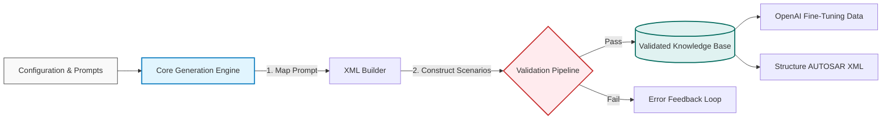

# Siemens Automation - AE Ecosystem


## Overview

**Siemens Automation AE Ecosystem** is a professional-grade environment designed to synthesize high-fidelity data for the automotive industry. It serves as a comprehensive ecosystem for generating complex **XML scenarios** that strictly adhere to AUTOSAR XSD schemas and Schematron rules.

This system is engineered to create a precise mapping between natural language **prompts** and their corresponding **XML structures**. By supporting varying styles (technical, narrative, direct) and complexity levels (small to large), the ecosystem produces diverse datasets that are ideal for **fine-tuning Large Language Models (LLMs)** like OpenAI's GPT series, effectively bridging the gap between human intent and machine-readable automotive standards.

## Key Features

*   **Schema-Compliant XML Generation**: Produces valid ARXML files by strictly enforcing industry standards through a multi-layer validation pipeline (XSD + Schematron).
*   **Prompt-to-XML Mapping**: Maintains a direct correlation between the input prompt's intent and the generated XML architecture, ensuring high-quality supervised learning data.
*   **Diverse Data Synthesis**: Generates data across 14 specialized automotive categories, with variable styles and sizes to prevent overfitting during model training.
*   **OpenAI Fine-Tuning Ready**: Outputs clean, structured `.jsonl` datasets specifically formatted for optimizing AI models on automotive domain knowledge.
*   **Triple-Layer Validation**:
    1.  **Structure**: XSD Schema conformance.
    2.  **Logic**: Schematron rule enforcement for business constraints.
    3.  **Semantic**: Advanced Python-based logical consistency checks.

## System Architecture

The following diagram illustrates the streamlined flow from data configuration to various validated outputs.



## Project Structure

```text
Siemens-AE-Ecosystem/
├── core/                 # XML generation logic and template mapping
├── services/             # Orchestration services for data export and analysis
├── managers/             # Configuration managers for categories and files
├── validators/           # Triple-layer validation engine
├── cli/                  # Command Line Interface tools
├── Studio_CLI.py         # Primary CLI entry point
├── gui_app.py            # Streamlit-based graphical interface
├── AE_XSD_schema.xsd.xml # AUTOSAR Schema Definition
└── SchematronRules.sch   # Business Logic Rules
```

## Installation & Setup

### Prerequisites
*   Python 3.8 or higher
*   Git version control

### Quick Start

1.  **Clone the Repository**
    ```bash
    git clone https://github.com/YOUR_USERNAME/Siemens-Automation-AE-Ecosystem.git
    cd Siemens-Automation-AE-Ecosystem
    ```

2.  **Install Dependencies**
    ```bash
    pip install -r requirements.txt
    ```

3.  **Launch the Ecosystem**
    *   **GUI Mode (Recommended):**
        ```bash
        streamlit run gui_app.py
        ```
    *   **CLI Mode:**
        ```bash
        python Studio_CLI.py
        ```

## Contribution
Contributions are encouraged. Please ensure all code changes successfully pass the internal `validation_pipeline.py` checks before submitting a pull request to maintain ecosystem integrity.

---
*Developed for Siemens .*
